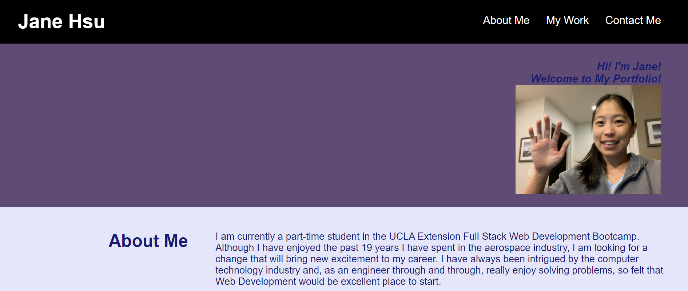

# Week 16 Project - Portfolio v3.0

## Table of Contents

* [Deployment](#deploy)
* [Description of Challenge](#description)
* [Execution of the Challenge](#execution)
* [Lessons Learned](#lessons)
* [More A-ha in the Future, aka Challenges to Get Over](#challenges)

## Deployment 

* The Portfolio v3.0 is deployed at the following live URL:
https://plainjane99.github.io/Portfolio/

You should see the following:

* The application code for this challenge is located at the following GitHub repository:
https://github.com/plainjane99/Portfolio

## Description of Challenge 

Week 15 and Week 16 were "Project 2" weeks for the UCLA Extension Full Stack Development Bootcamp.  The goal of Project 2 was to bring a small group together to create an interactive full-stack application that would take the team through building an application from scratch by using all of the tools learned to date.  Once the project was completed, part of the grading criteria was to update this portfolio with the Project 2 URL.  

* This Portfolio 3.0 adds the links to respective project live URLs.
* Revises the About-Me section with more recent information as well as additional useful information.

## Execution of the Challenge 

Execution of Project 2 was challenging but an excellent learning assignment.  I went into the Project with a very basic understanding of the full-stack, and after two weeks of solid code writing and debugging, I feel that I have a significantly better understanding.  There are still many aspects of code that continue to be a challenge, as indicated by the "future developments" the team would want to incorporate into "Fitness Pal" application, but it is amazing to see what we were able to accomplish.  Check out Project 2: Full Stack Application!

## Lessons-Learned 

There are so many lessons learned to count.  For the back-end, I learned that writing models and routes can require significant planning.  We went through a few iterations which always broke our code when there was a missing attribute in a model.  The front end developer may have an idea of the data required or how the code will be passed which may differ from the back end developer; communication was essential to getting just the right attributes and just the right routes.  For the front end, we learned that passing information from page to page can be difficult.  Data needs to be received in just the right format in order to be utilized.

## More A-ha in the Future, aka Challenges to Get Over 

I am looking forward to all of the new challenges (knowledge-yet-to-be-learned) ahead of me!

Thanks for reading this README.md.
